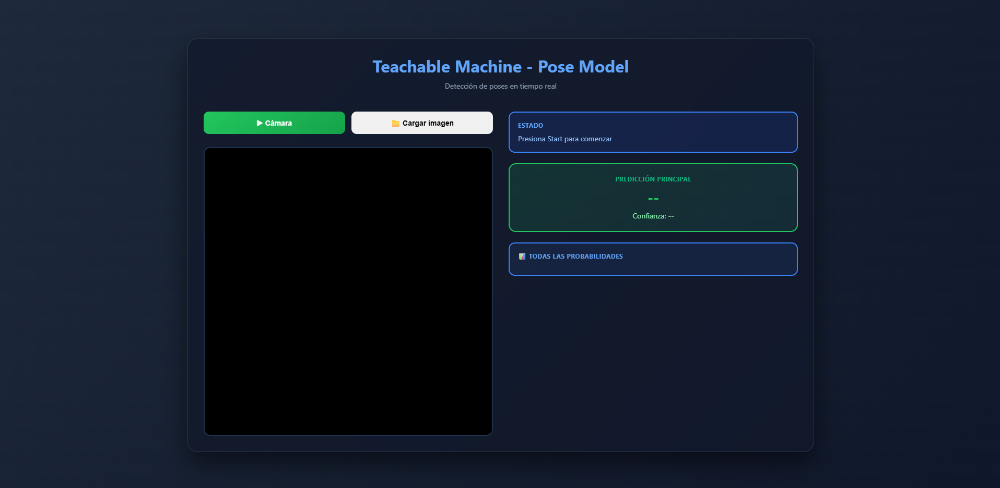

# ML Web Page

Página web de demostración que detecta posturas (de pie, sentado, acostado).

## Descripción
Pequeña página que carga un modelo de poses localizado en `my-pose-model/` y muestra resultados en el navegador. El modelo puede clasificar posturas comunes —por ejemplo: **de pie**, **sentado** y **acostado**— y muestra los keypoints y el esqueleto sobre el `canvas`.

## Capturas de pantalla

```

```

- Captura principal: `screenshots/main.png`
- Interacción: `screenshots/interaction.png`

## Cómo usar (rápido)
- Iniciar cámara: pulsa el botón **Cámara** para activar la webcam y ver detección en tiempo real.
- Cargar imagen: pulsa **Cargar imagen** y selecciona un archivo; la página procesará la imagen y mostrará la predicción.

### Apartados para subir imágenes
- `screenshots/main.png` — captura principal de la interfaz.
- `screenshots/interaction.png` — ejemplo de detección sobre imagen subida o cámara.

## Tecnologías usadas
- HTML5
- CSS3
- JavaScript
- Teachable Machine Pose Model (Google)

## Uso rápido

```bash
python -m http.server 8000
# o
npx http-server . -p 8000
```

Luego abrir `http://localhost:8000`.


